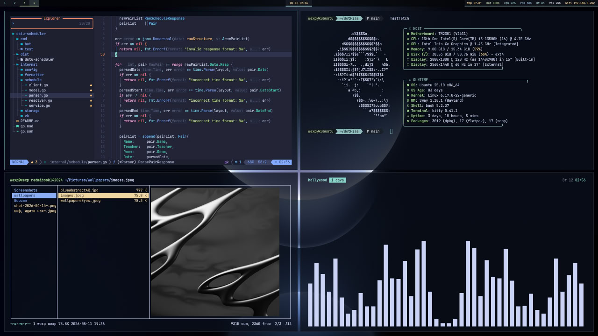

# swayRice

Minimal dark teal rice for Sway on Wayland.

## Preview

## About

This is my personal Sway rice focused on a clean dark layout, teal/green color scheme, minimal Waybar, Kitty terminal, Starship prompt, Fastfetch, Ranger, Rofi and custom scripts.

## Stack

| Component | Tool |
|---|---|
| Window Manager | Sway |
| Terminal | Kitty |
| Bar | Waybar |
| Launcher | Rofi |
| Shell | Bash / Fish |
| Prompt | Starship |
| Fetch | Fastfetch |
| File Manager | Ranger |
| Notifications | Dunst |
| Lock Screen | Swaylock |
| Autotiling | Custom sway-autotiling script |
| Font | JetBrainsMono Nerd Font |

## Features

- Minimal Sway configuration
- Clean Waybar top panel
- Kitty terminal rice
- Starship powerline-style prompt
- Fastfetch with custom skull logo
- Ranger file manager with Kitty image preview
- Rofi launcher
- Rofi Wi-Fi menu
- Rofi Bluetooth menu
- Custom Swaylock lockscreen with blurred background, time and date
- Autotiling / spiral-like window placement
- Screenshot shortcuts copied directly to clipboard
- Hotkeys work on both English and Russian keyboard layouts
- Automatic install script

## Structure

    swayRice/
    ├── sway/
    │   └── config
    ├── waybar/
    │   ├── config
    │   ├── style.css
    │   └── scripts/
    ├── kitty/
    │   └── kitty.conf
    ├── rofi/
    │   ├── config.rasi
    │   └── theme.rasi
    ├── fastfetch/
    │   ├── config.jsonc
    │   └── logos/
    ├── fish/
    │   └── config.fish
    ├── ranger/
    │   ├── rc.conf
    │   ├── rifle.conf
    │   └── scope.sh
    ├── scripts/
    │   ├── lockscreen
    │   ├── wifi-connect
    │   ├── bt-menu
    │   ├── sway-autotiling
    │   ├── kfm
    │   ├── ktmux
    │   └── powermenu
    ├── starship.toml
    ├── tmux.conf
    ├── HOTKEYS.md
    ├── install.sh
    └── README.md

## Automatic installation

Clone the repository:

    git clone git@github.com:Hayden2572/swayRice.git
    cd swayRice

Run installer:

    chmod +x install.sh
    ./install.sh

The installer will:

- install required packages;
- install JetBrainsMono Nerd Font;
- install Starship;
- back up existing configs to ~/.rice-backup/;
- copy configs to ~/.config/;
- copy scripts to ~/.local/bin/;
- replace hardcoded /home/wexp paths with the current user home path;
- reload Sway and Waybar if Sway is currently running.

## Manual installation

    mkdir -p ~/.config ~/.local/bin

    mkdir -p ~/.config/sway
    cp sway/config ~/.config/sway/config

    cp -r waybar ~/.config/
    cp -r kitty ~/.config/
    cp -r rofi ~/.config/
    cp -r fastfetch ~/.config/
    cp -r fish ~/.config/
    cp -r ranger ~/.config/

    cp starship.toml ~/.config/starship.toml
    cp tmux.conf ~/.tmux.conf

    cp scripts/* ~/.local/bin/
    chmod +x ~/.local/bin/*
    chmod +x ~/.config/waybar/scripts/* 2>/dev/null || true

Reload Sway:

    swaymsg reload

Restart Waybar:

    pkill waybar
    nohup waybar >/tmp/waybar.log 2>&1 &
    disown

## Main hotkeys

See HOTKEYS.md.

## Dependencies

Main packages:

    sway
    swayidle
    swaylock
    waybar
    kitty
    rofi
    dunst
    ranger
    fastfetch
    fish
    tmux
    grim
    slurp
    wl-clipboard
    brightnessctl
    playerctl
    pavucontrol
    bluez
    blueman
    imagemagick
    python3-i3ipc
    JetBrainsMono Nerd Font

The installer installs required packages automatically.

## Fastfetch

Run:

    ff

or:

    fastfetch --logo-color-1 white

## Screenshots

Screenshots are copied directly to clipboard.

Save clipboard screenshot to file:

    wl-paste > screenshot.png

## Security note

This repository does not include private data.

Do not publish:

    /etc/netplan/*.yaml
    /etc/NetworkManager/system-connections/*
    ~/.ssh/*
    .env
    tokens
    passwords
    personal documents

Wi-Fi passwords and Netplan configs are intentionally excluded.

## License

Use it however you want.
